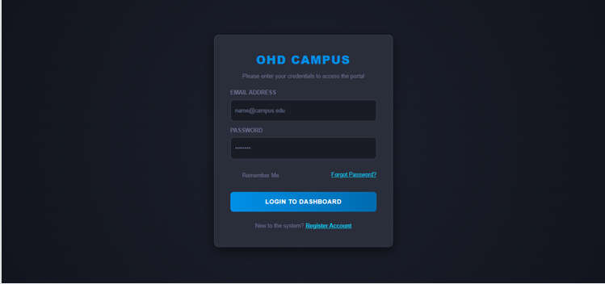
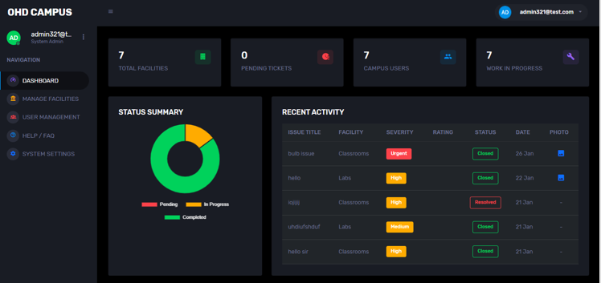
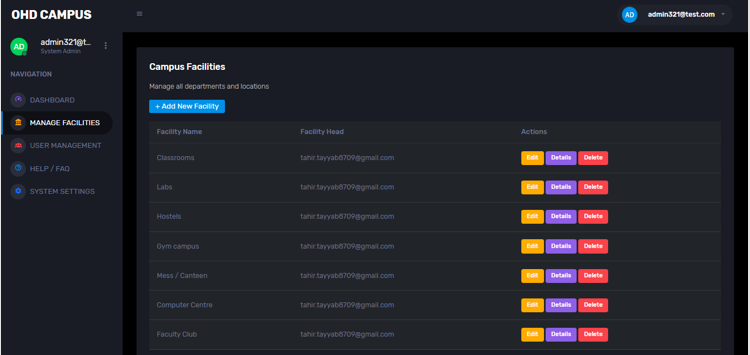
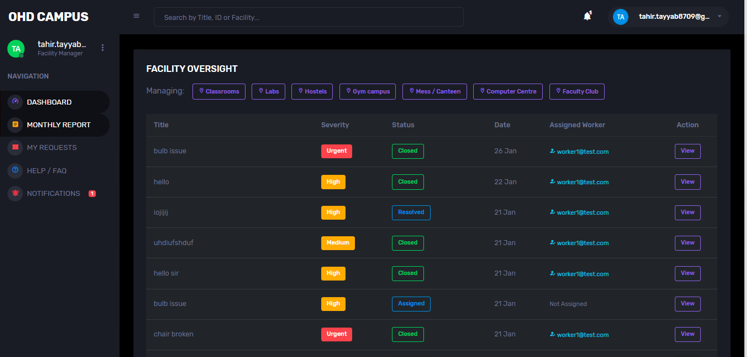
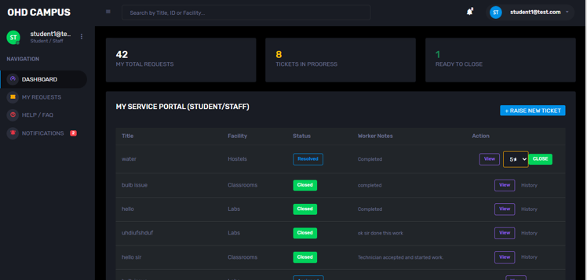
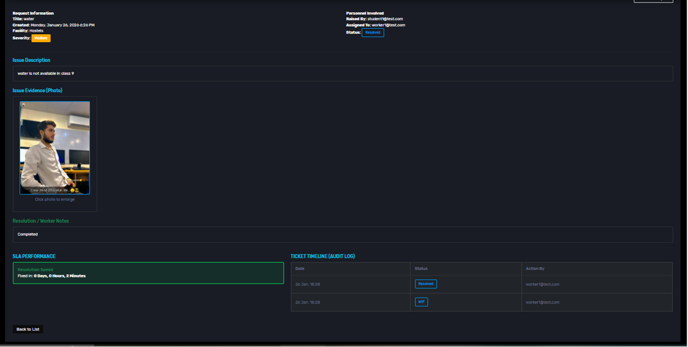

# Online HelpDesk - Campus System

An enterprise-grade campus help desk system built with ASP.NET Core MVC. Screenshots of the project:

## Login Page

## Admin Dashboard

## Manage Facilities

## Facility Oversight

## Student Request Panel

## Service Report

